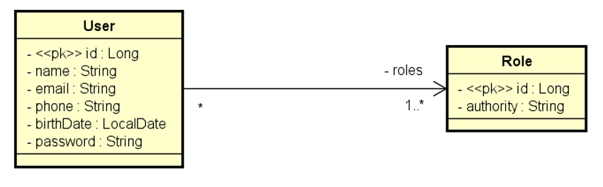

## Anotações e orientações para o desenvolvimento do backend.

### Parâmetros de paginação com a annotation `@RequestParam`:
```java
@RequestParam(value = "page", defaultValue = "0") Integer page,
@RequestParam(value = "linesPerPage", defaultValue = "12") Integer linesPerPage,
@RequestParam(value = "orderBy", defaultValue = "moment") String orderBy,
@RequestParam(value = "direction", defaultValue = "DESC") String direction
```
---

## ☑️ Config provisória para liberar todos endpoints e h2-console. (Sprint Boot 3.1+):
```java
import org.springframework.context.annotation.Bean;
import org.springframework.context.annotation.Configuration;
import org.springframework.security.config.annotation.web.builders.HttpSecurity;
import org.springframework.security.web.SecurityFilterChain;

@Configuration
public class SecurityConfig {

	@Bean
	public SecurityFilterChain filterChain(HttpSecurity http) throws Exception {
		http.csrf(csrf -> csrf.disable())
        // LIBERA iframes para vizualização de h2-console no navegador.
        .headers(headers -> headers.frameOptions(frame -> frame.disable())); 

		http.authorizeHttpRequests(auth -> auth.anyRequest().permitAll());
		return http.build();
	}
}
```

---

### 🔒 Criptografar senha inserida por usuário:
```java
import org.springframework.context.annotation.Bean;
import org.springframework.context.annotation.Configuration;
import org.springframework.security.crypto.bcrypt.BCryptPasswordEncoder;

//Classe base para criptografar senhas
@Configuration
public class AppConfig {
    
    @Bean
    public BCryptPasswordEncoder passwordEncoder() {
        return new BCryptPasswordEncoder();
    }
}
```
```java
// --- No service do User ---
@Autowired
    private BCryptPasswordEncoder passwordEncoder;

@Transactional
    public UserDTO insert(UserIsertDTO dto) {
        User entity = new User();
        copyDtoToEntity(dto, entity);

        //Criptografando password com BCryptPasswordEncoder da classe AppConfig
        entity.setPassword(passwordEncoder.encode(dto.getPassword())); 
        
        entity = userRepository.save(entity);
        return new UserDTO(entity);
    }
```

---

## ⚠️ Contraint Validator Customizado

- Criar a própria regra de validação, quando as anotações padrão como `@NotBlank`, `@Size`, `@Email`, etc., não são suficientes. Quando precisar validar regras específicas de negócio, como:

    - Um CPF/CNPJ válido

    - Um campo confirmPassword igual ao password

    - Verificar se um valor está dentro de uma lista do banco

    - Se uma data é futura em relação a outra

    - Verificar se um email já existe no banco (em DTO de cadastro)

**Código base:**
```java
import java.lang.annotation.ElementType;
import java.lang.annotation.Retention;
import java.lang.annotation.RetentionPolicy;
import java.lang.annotation.Target;

import jakarta.validation.Constraint;
import jakarta.validation.Payload;

@Documented //incluir annotation no Javadoc
@Constraint(validatedBy = UserInsertValidator.class)
@Target({ ElementType.TYPE })
@Retention(RetentionPolicy.RUNTIME)
public @interface UserInsertValid {
	String message() default "Validation error";

	Class<?>[] groups() default {};

	Class<? extends Payload>[] payload() default {};
}
```
**UserInsertValidator:**
```java
import java.util.ArrayList;
import java.util.List;

import com.truelanz.catalog.controllers.handlers.FieldMessage;
import com.truelanz.catalog.dto.UserInsertDTO;

import jakarta.validation.ConstraintValidator;
import jakarta.validation.ConstraintValidatorContext;

public class UserInsertValidator implements ConstraintValidator<UserInsertValid, UserInsertDTO> {
	
	@Override
	public void initialize(UserInsertValid ann) {
	}

	@Override
	public boolean isValid(UserInsertDTO dto, ConstraintValidatorContext context) {
		
        //Importa a classe FieldMessage que trata as Validations Exceptions.
		List<FieldMessage> list = new ArrayList<>();
		
		// Coloque aqui seus testes de validação, acrescentando objetos FieldMessage à lista
		
		for (FieldMessage e : list) {
			context.disableDefaultConstraintViolation();
			context.buildConstraintViolationWithTemplate(e.getMessage()).addPropertyNode(e.getField())
					.addConstraintViolation();
		}
		return list.isEmpty();
	}
}
```
---

## ⚙️ .properties configs:
`application.properties`
```properties
# Configurações gerais, funciona em todos os perfis

spring.jpa.open-in-view=false

spring.profiles.active=test
```
`application-test.properties`
```properties
# Configurações específica, perfil de teste

# H2 Connection
spring.datasource.url=jdbc:h2:mem:testdb
spring.datasource.username=sa
spring.datasource.password=

# H2 Client
spring.h2.console.enabled=true
# localhost:8080/h2-console
spring.h2.console.path=/h2-console

# Show SQL on console
spring.jpa.show-sql=true
spring.jpa.properties.hibernate.format_sql=true
```
`application-dev.properties`
```properties
# --- Configs para desenvolvimento com SGDBs ---
#spring.jpa.properties.jakarta.persistence.schema-generation.create-source=metadata
#spring.jpa.properties.jakarta.persistence.schema-generation.scripts.action=create
#spring.jpa.properties.jakarta.persistence.schema-generation.scripts.create-target=create.sql
#spring.jpa.properties.hibernate.hbm2ddl.delimiter=;

spring.datasource.url=jdbc:postgresql://localhost:5432/dscatalog
spring.datasource.username=postgres
spring.datasource.password=1234567

spring.jpa.database-platform=org.hibernate.dialect.PostgreSQLDialect
spring.jpa.properties.hibernate.jdbc.lob.non_contextual_creation=true
spring.jpa.hibernate.ddl-auto=none
```
`application-prod.properties`
```properties
# Config para ambiente de produção
spring.datasource.url=${DATABASE_URL}

spring.jpa.hibernate.ddl-auto=none
spring.jpa.show-sql=false
spring.jpa.properties.hibernate.format_sql=false
```
---

## 🗝️ Adicionar Segurança com Spring security e OAuth2 

### 1. Modelo de domínio User-Role


### 2. Dependências
```xml
<dependency>
	<groupId>org.springframework.boot</groupId>
	<artifactId>spring-boot-starter-security</artifactId>
</dependency>

<dependency>
	<groupId>org.springframework.security</groupId>
	<artifactId>spring-security-test</artifactId>
	<scope>test</scope>
</dependency>

<dependency>
	<groupId>org.springframework.security</groupId>
	<artifactId>spring-security-oauth2-authorization-server</artifactId>
</dependency>

<dependency>
	<groupId>org.springframework.boot</groupId>
	<artifactId>spring-boot-starter-oauth2-resource-server</artifactId>
</dependency>
```

### 3. Checklist Spring security
- GrantedAuthority
- UserDetails
- UserDetailsService
- UsernameNotFoundException

### 4. Configs de properties
```properties
security.client-id=${CLIENT_ID:myclientid}
security.client-secret=${CLIENT_SECRET:myclientsecret}

security.jwt.duration=${JWT_DURATION:86400}

cors.origins=${CORS_ORIGINS:http://localhost:3000,http://localhost:5173}
```

### 5. Checklist OAuth2 JWT password grant
- Base de referencia: [password-grant](https://github.com/truelanz/spring-boot-oauth2-jwt-demo/tree/main/password-grant)
- Implementação customizada do password grant
Authorization server
- Resource server

---

>## Consultas com `JOIN FETCH` (_evitando consultas lentas n:1_)

### Join Fetch n:1 (todos)
```java
//JPQL
@Query(value = "SELECT obj FROM Employee obj JOIN FETCH obj.department")
	List<Employee> searchAll();
```

### Join Fetch n:n (todos)
```java
//JPQL
//Seleciona todos os produtos (obj) e as categorias pelo atributo n:n categories, com obj.categories
@Query(value = "SELECT obj FROM Product obj JOIN FETCH obj.categories")
	public List<Product> searchAll();
```

### Join Fetch n:1 (quando paginado usar countQuery)
```java
//Native Query
@Query(nativeQuery = true, value = """
        SELECT DISTINCT p.id, p.name 
        FROM tb_product p
        INNER JOIN tb_product_category pc ON p.id = pc.product_id
        WHERE (:categoryIds IS NULL OR pc.category_id IN :categoryIds)
        AND LOWER(p.name) LIKE LOWER(CONCAT('%', :name, '%'))
        ORDER BY p.name
        """, countQuery = """
        SELECT COUNT(*) FROM (
            SELECT DISTINCT p.id, p.name 
            FROM tb_product p
            INNER JOIN tb_product_category pc ON p.id = pc.product_id
            WHERE (:categoryIds IS NULL OR pc.category_id IN :categoryIds)
            AND LOWER(p.name) LIKE LOWER(CONCAT('%', :name, '%'))
        ) AS tb_result
    """)
    Page<ProductProjection> searchProducts(List<Long> categoryIds, String name, Pageable pageable);
```
---

>## Casos de uso da aplicação (Consulta paginada de produtos)
1. [OUT] O **sistema** informa id e nome de **todas** categorias de produto
2. [IN] O **usuário** informa:
	- trecho do nome do produto (opcional)
	- categorias de produto desejadas (opcional)
	- número da página desejada
	- quantidade de itens por página
3. [OUT] O **sistema** informa uma listagem paginada dos produtos com suas respectivas categorias, conforme os critérios de consulta, ordenados por nome.

>## Signup

- Signup
- Recuperação de senha
- Obter usuário logado
- Consultas ao banco de dados
- Envio de Gmail.